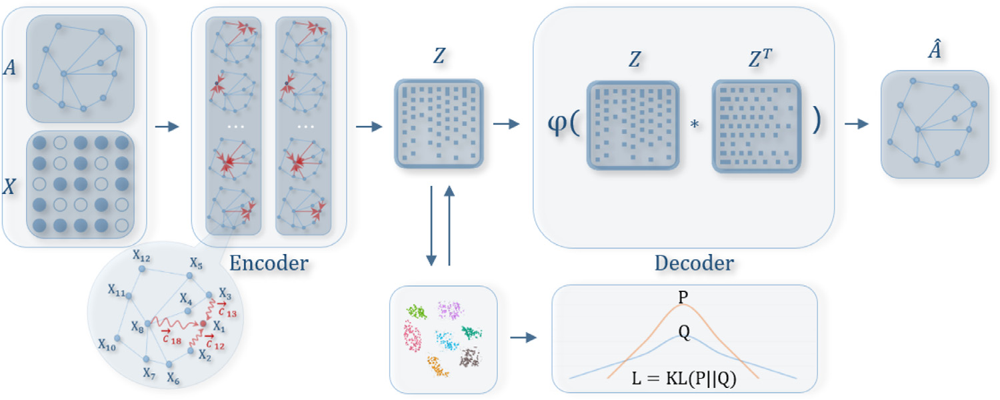

# GAT Experiments

:construction: **UNDER CONSTRUCTION** :construction:

## O projeto

Através de uma metodologia hipotético-dedutiva, este trabalho tem como objetivo compreender melhor a dependência de agrupadores externos quando GNNs são utilizadas para tarefas de detecção de comunidades, e também propor alternativas a ponto de remover completamente a dependência de um agrupador externo na utilização de GNNs para este tipo de tarefa.

Este projeto implementa o algoritmo proposto em [Deep neighbor-aware embedding for node clustering in attributed graphs](https://www.sciencedirect.com/science/article/abs/pii/S0031320321004118), compara os resultados objetidos com os que foram apresentados no artigo original e propõe algumas variações no algoritmo.



### Testes e variações:

Até o presente momento, as sugestões de testes e variações podem incluir:

- Novos mecanismos para a detecção de centróides;
- Novas funções de Loss e variação de pesos;
- Variações na estrutura e parâmetros da rede;
- Novas funções para detecção das classes;
- Testes paramétricos variados;

Todos os testes e variações serão implementadas e documentadas neste repositório.

### Centroides por detecção de comunidades

Uma das abordagens escolhidas para teste e comparação é a detecção de comunidades via algoritmos como Fast Greedy, e posteriormente o mapeamento dos centroids via grau de conectividade. Isso substitui o KMeans como mecanismos inicial de detecção dos centroides. Os resultados dos testes devem ser compartilhados via este repositório.

### Centroides por seleção de sementes

Outro mecanismo a ser avaliado por este projeto é o mecanismo de Seed Expansion para a detecção dos centroides iniciais. Dessa forma, não seria necessária a detecção de comunidades. Acreditamos que esta abordagem pode trazer um ganho de eficiência para o algoritmo como um todo, mas não temos ainda resultados para afirmar a qualidade de tal abordagem.

### Seleção de sementes com base em atributos dos nós

Uma abordagem a ser implementada e testada por este projeto, é a implementação da seleção de sementes com base nos atributos dos nós. Isso pode ocorrer atribuindo a distância entre nós com base na semelhança entre atributos do nós, por exemplo. Uma possível abordagem, é a implementação de um K-Core ponderado, que considera o peso das arestas na seleção dos subgrafos. Outros algoritmos devem ser implementados e avaliados.

## Como executar

Crie um ambiente virtual Python e instale as dependências necessárias:

```
python3 -m venv ./env
source ./env/bin/activate
pip install -r requirements.txt
```

O arquivo `run.py` executa o algoritmo e possui alguns parâmetros que podem ajustar o treinamento da rede. Para mais informações, execute: `python run.py --help`.

### Seletores de centróides implementados:

Até o presente momento, este projeto conta com a implementação dos seguintes algoritmos para a seleção de centróides:

- KMeans;
- Fastgreedy;
- K-core (via _k-score_);
- PageRank;

## Autores:

Alan Demétrius Baria Valejo

Carlos Pereira Lopes Filho

Guilherme Henrique Messias
